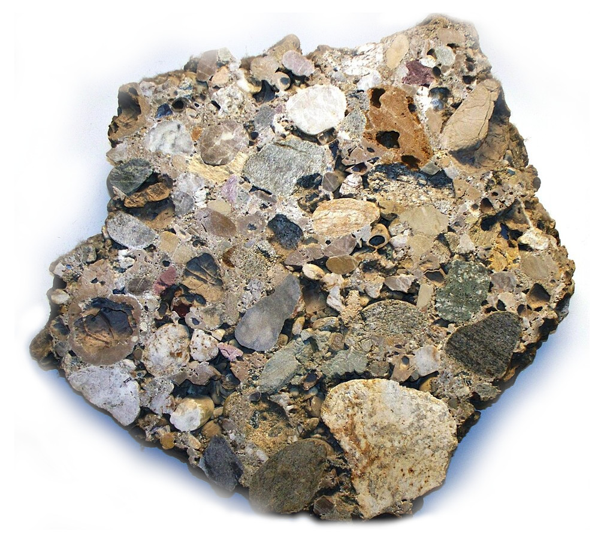

# YmerFlow — Cloud-Native Geophysics



Browser-based AEM and magnetic survey processing, inversion, and pipeline automation — no Windows install, no per-seat licenses, no black-box algorithms.

YmerFlow replaces desktop-bound geophysics tools with a reproducible, versioned workflow platform that runs in any browser. Processing pipelines are defined as visual DAGs, executed in Kubernetes containers, and stored in per-project cloud storage so results are always reproducible. The inversion core is [SimPEG](https://simpeg.xyz/) (GPL v3) — peer-reviewed, auditable, and extensible.

| Process graph view | Process editor |
|---|---|
| .png) |  |


## Features

<div class="feature-grid" markdown="1">

<div class="feature-card" markdown="1">

### Visual Pipeline Editor
🔀 DAG-based process graph showing dependencies and data flow  
🖱️ Drag-and-drop interface with resizable splits, tabs, and popout windows for multi-monitor workflows  
📡 Real-time log streaming via WebSocket  
💰 Usage-based billing with upfront cost estimates per job  
💾 Persistent layout configuration  

</div>

<div class="feature-card" markdown="1">

### Geophysics Processing & Inversion
🛜 AEM (TEM) processing and 1D/3D inversion via SimPEG — open, peer-reviewed algorithms  
🧲 Magnetic processing, equivalent-source gridding, and 3D magnetic inversion  
🔌 Plugin process types: any Python `schema()` + `run()` pair registers as a new process type, so custom algorithms slot in without forking the platform  

</div>

<div class="feature-card" markdown="1">

### Scientific Visualization
🗻 3D resistivity curtains along flightlines and voxel grids for 3D inversion results  
🌐 Geographic map view with EPSG coordinate axes and flightline plotting  
📊 Extensible plot element system with unit-aware axis matching  

</div>

<div class="feature-card" markdown="1">

### Kubernetes-Based Compute
📦 Containerized process execution with per-job resource limits (CPU, memory, deadline)  
⚙️ Kueue job queuing for fair cluster scheduling and efficiency  
🔄 Automatic cleanup and retry logic  
📈 Scales to large surveys without manual infrastructure management  

</div>

<div class="feature-card" markdown="1">

### Storage
🔐 Per-project S3/GCS-compatible object storage with scoped credentials and IAM security  
🏷️ Versioned outputs — every pipeline run is reproducible  
☁️ MinIO for local development, GCS/S3 in production  
⚡ Automatic bucket provisioning  

</div>

</div>

## Getting Started

See the **[Quickstart Guide](docs/quickstart.md)** to go from zero to a running system in minutes, or the **[Deployment Guide](docs/deployment.md)** for production mode, admin tools, and cloud deployment and the **[User Guide](docs/user-guide.md)** for full coverage of the interface, datasets, billing, and troubleshooting.

## Documentation

YmerFlow uses a distributed architecture with browser-based UI, FastAPI backend, and Kubernetes for process execution:

```
Frontend (React) → Backend (FastAPI) → Kubernetes Cluster
                                       ├─> Kueue → Job → Pod (process execution)
                                       ├─> Log streaming via WebSocket
                                       └─> MinIO (development) / GCS/S3 (production)
                                           └─> Per-project buckets with IAM
```

### Architecture
- **[System Overview](docs/architecture/overview.md)** - Backend/frontend components, data flow, Kubernetes resources
- **[Technology Stack](docs/architecture/technology-stack.md)** - Complete list of technologies, libraries, and tools
- **[Environment](docs/architecture/environment.md)** - Docker images, entrypoints, runner, schema extraction
- **[Process Types](docs/architecture/processes.md)** - Creating custom process types, schemas, registration
- **[Storage](docs/architecture/storage.md)** - Per-project buckets, security model, fsspec usage

### Frontend
- **[Widget System](docs/frontend/widgets.md)** - Creating widgets, built-in widgets, plot elements
- **[Layout System](docs/frontend/layout.md)** - Flexout drag-and-drop, splits, tabs, popouts
- **[JSON Schema Forms](docs/frontend/forms.md)** - Custom forms, dataset selector, validation

### Operations
- **[Deployment Guide](docs/deployment.md)** - Development and production setup, Minikube, MinIO, cloud deployment
- **[Development Guide](docs/development.md)** - Development workflows, testing, debugging, contributing

## Contributing

See [Development Guide](docs/development.md) for development workflows, testing, and contribution guidelines.

For guidance when working with Claude Code, see [CLAUDE.md](CLAUDE.md).

## License

Copyright (c) 2026 Egil Möller

This program is free software: you can redistribute it and/or modify
it under the terms of the GNU General Public License as published by
the Free Software Foundation, either version 3 of the License, or
(at your option) any later version.

This program is distributed in the hope that it will be useful,
but WITHOUT ANY WARRANTY; without even the implied warranty of
MERCHANTABILITY or FITNESS FOR A PARTICULAR PURPOSE. See the
GNU General Public License for more details.

You should have received a copy of the GNU General Public License
along with this program in the [LICENSE file](LICENSE). If not, see <https://www.gnu.org/licenses/>.
